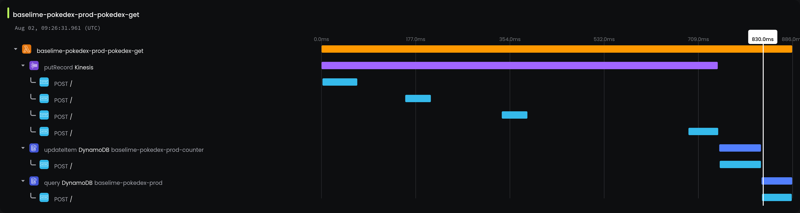

# Lambda Opentelemetry for Node.JS
[![Documentation][docs_badge]][docs]
[![Latest Release][release_badge]][release]
[![License][license_badge]][license]

> Don't install this package - add it via the `baselime:tracing` tag

The `@baselime/lambda-node-opentelemetry` package instruments your Node.js AWS Lambda functions with OpenTelemetry and automatically sends tracing data to Baselime. This is the most powerful and flexible way to instrument your serverless functions.

### Automatic Installation

Once you've connected your AWS account to Baselime, add the `baselime:tracing` tag to any of your Node.js AWS Lambda functions and it will be automatically instrumented with OpenTelemetry.

## License

&copy; Baselime Limited, 2023

Distributed under MIT License (`The MIT License`).

See [LICENSE](LICENSE) for more information.

<!-- Badges -->

[docs]: https://baselime.io/docs/
[docs_badge]: https://img.shields.io/badge/docs-reference-blue.svg?style=flat-square
[release]: https://github.com/baselime/lambda-node-opentelemetry/releases/latest
[release_badge]: https://img.shields.io/github/release/baselime/lambda-node-opentelemetry.svg?style=flat-square&ghcache=unused
[license]: https://opensource.org/licenses/MIT
[license_badge]: https://img.shields.io/github/license/baselime/lambda-node-opentelemetry.svg?color=blue&style=flat-square&ghcache=unused
